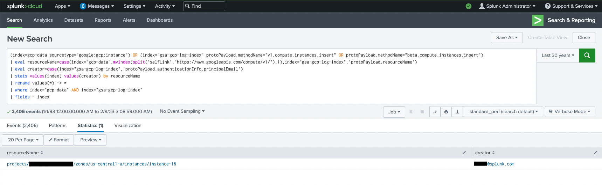
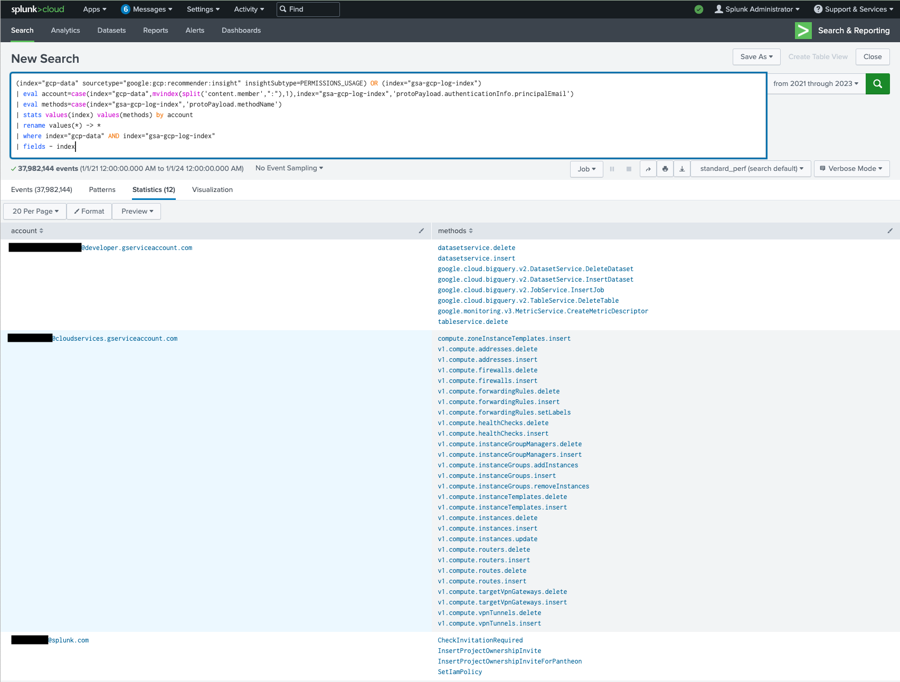

# The Unix Approach to Getting Google Cloud Data into Splunk


If you are a Splunk user that's ingesting Google Cloud data, you're likely familiar with the [Splunk Add-on for Google Cloud Platform](https://splunkbase.splunk.com/app/3088) and the [Splunk Dataflow template](https://cloud.google.com/architecture/deploying-production-ready-log-exports-to-splunk-using-dataflow). Both of these solutions are great for moving logs via [Pub/Sub](https://cloud.google.com/pubsub/docs/) into Splunk. But did you know there are ways of extracting other non-logging Google Cloud data and quickly shipping it to Splunk using common command-line tools? 

The Unix philosophy promotes the use of small, simple, and modular programs that can be combined to accomplish more complex tasks. In simpler terms, "do one thing and do it well." In this blog post, I'll embrace this philosophy and demonstrate example use cases to help you discover and export interesting Google Cloud data into your Splunk environment. 

## Prerequisites

To follow along with the examples in this blog, you will need to have the [Google Cloud CLI](https://cloud.google.com/sdk/docs/install) installed as it provides the `gcloud` and `bq` commands. In addition, you will need to have both [`jq`](https://stedolan.github.io/jq/download/) and [`curl`](https://curl.se/download.html) installed. These utilities can be downloaded and installed directly or obtained through common package managers such as `homebrew`, `yum`, or `apt`. Alternatively, you can use an environment such as the [Google Cloud Shell](https://cloud.google.com/shell/), which comes pre-installed with the necessary tools.

You will also need a Splunk Cloud or Splunk Enterprise environment configured with a HTTP Event Collector (HEC) token and an index for the data. Export the HEC token to the shell environment as shown below.

```
export HEC_TOKEN=<TOKEN>
```

Please also set the full HEC URL. For example:

```
export HEC_URL=https://<ADDRESS>:8088/services/collector/event
```

For more information on how to construct a HEC URL for Splunk Cloud Platform trials, Splunk Cloud on AWS, and Splunk Cloud on GCP, please see the "[Send data to HTTP Event Collector](https://docs.splunk.com/Documentation/Splunk/9.0.3/Data/UsetheHTTPEventCollector#Send_data_to_HTTP_Event_Collector)" section of the [HTTP Event Collector documentation](https://docs.splunk.com/Documentation/Splunk/latest/Data/UsetheHTTPEventCollector).

An existing destination index name must also be set. Some of the commands that will be run may contain timestamps that are quite old, so ensure the index lifetime is generous enough to avoid aging out data immediately. I recommend using a dedicated index for the purpose of this demonstration. 

```
export SPLUNK_INDEX=gcp-data
```

To set `curl` arguments such as `-k` or `--insecure` for untrusted certificate environments, export the `CURL_ARGS` variable as shown below.

```
export CURL_ARGS=-k
```

Finally, set an explicit Google Cloud project. You can find a list of projects using the `gcloud projects list --format=flattened` command. For example:

```
gcloud projects list --format=flattened
---
createTime:     2022-01-12T21:34:27.797Z
lifecycleState: ACTIVE
name:           <REDACTED>
parent.id:      <REDACTED>
parent.type:    organization
projectId:      abcd-123456
projectNumber:  <REDACTED>
---
createTime:      2016-11-29T18:10:06.711Z
labels.firebase: enabled
lifecycleState:  ACTIVE
name:            <REDACTED>
projectId:       my-project-123456
projectNumber:   <REDACTED>
```

Look for the `projectId` value and set it as an environment variable as shown below.

```
export GCP_PROJECT=<PROJECT_ID>
```

### Utilities

The following is a summary of the tools we will be using throughout the examples.

#### gcloud

`gcloud` is a command-line tool that allows users to manage and interact with GCP resources and services. It's included in the [Google Cloud CLI](https://cloud.google.com/sdk/docs/install).

#### bq

`bq` allows interacting with BigQuery, which is GCP's fully-managed, serverless data warehouse. It is also included in the [Google Cloud CLI](https://cloud.google.com/sdk/docs/install).

#### jq

`jq` is like `sed` but for working with JSON data. It is commonly used to parse, filter, and manipulate JSON data from the command line. 

#### split

`split` breaks a file into smaller files. It is part of the "GNU Core Utilities" package and is usually available by default on Unix-like systems.

#### curl

`curl` is a command-line tool for transferring data using various protocols, primarily used for making HTTP requests to retrieve or send data to web servers. 

## Examples

Each of these examples follows roughly the same approach. First, the data is extracted using `gcloud`. Next, the output is parsed and enriched using `jq` to create a payload suitable for sending to a HEC endpoint. Once formatted for HEC, `curl` is invoked to deliver the data to Splunk. In cases where the output of `gcloud` could be large, we'll introduce `split` to break things into chunks.

Now that we have covered the prerequisites, tools, and general approach we will use, let's dive into the examples.

### Cloud Assets

The `gcloud asset list` command can be used to retrieve a list of assets in a specified GCP project or organization. To handle large asset lists, we'll break them into smaller files using the `split` command before sending them to a Splunk HEC.

```
mkdir assets && cd $_; gcloud asset list --project ${GCP_PROJECT} --format=json | jq -c --arg host $(hostname) --arg index ${SPLUNK_INDEX} '{"host": $host, "source": "gcloud", "sourcetype": "google:gcp:asset", "index": $index, "event": .[]}' | split - assets- ; for FILE in *; do echo processing ${FILE}; curl ${CURL_ARGS} ${HEC_URL} -H "Authorization: Splunk ${HEC_TOKEN}" --data-binary @${FILE}; done
```

For this first example use case, let's break the commands into components to better understand each step of the pipeline.

```
mkdir assets && cd $_
```

The first command above creates a directory called `assets` and switches into it, assuming creation is successful.

```
gcloud asset list --project ${GCP_PROJECT} --format=json
```

The next command invokes `gcloud` and requests a list of assets. Using the `--format=json` parameter returns the results as JSON. The following is example data returned from this command:

```
[
  {
    "ancestors": [
      "projects/<REDACTED>"
    ],
    "assetType": "apikeys.googleapis.com/Key",
    "name": "//apikeys.googleapis.com/projects/<REDACTED>/locations/global/keys/<REDACTED>",
    "updateTime": "2022-10-18T09:15:12.026452Z"
  },
  {
    "ancestors": [
      "projects/<REDACTED>"
    ],
    "assetType": "appengine.googleapis.com/Application",
    "name": "//appengine.googleapis.com/apps/<REDACTED>",
    "updateTime": "2022-10-21T02:43:20.551Z"
  },
...
  {
    "ancestors": [
      "projects/<REDACTED>"
    ],
    "assetType": "storage.googleapis.com/Bucket",
    "name": "//storage.googleapis.com/us.artifacts.<REDACTED>.appspot.com",
    "updateTime": "2022-10-22T00:35:56.935Z"
  }
]
```

Notice that the results are returned as a list of dictionary objects, where each item in the list is an asset. For the purposes of this example, we'd like to pipe this lengthy output into `jq`, iterate through each item in the JSON list, and output each individual item as a separate new-line delimited JSON structure. 

```
jq -c --arg host $(hostname) --arg index ${SPLUNK_INDEX} '{"host": $host, "source": "gcloud", "sourcetype": "google:gcp:asset", "index": $index, "event": .[]}' 
```

This `jq` command uses the `-c` flag to ensure each JSON object appears on a single line. A variable named `host` is set to the local system hostname. Additionally, a variable named `index` is set to the Splunk index name we previously set via `export` in the prerequisites section of this blog. Finally, we provide the scaffolding for a HEC-compliant data structure with a `host`, `source`, `sourcetype`, `index`, and `event` field. The `.[]` portion of the JSON payload tells `jq` to iterate through the list of items in the input stream and apply the transformation across each item. The final result is a new-line delimited collection of JSON objects as seen below. Notice each line is a distinct HEC event message and JSON data structure.

```
{"host":"cs-<REDACTED>-default","source":"gcloud","sourcetype":"google:gcp:asset","index":"gcp-data","event":{"ancestors":["projects/<REDACTED>"],"assetType":"apikeys.googleapis.com/Key","name":"//apikeys.googleap
is.com/projects/<REDACTED>/locations/global/keys/<REDACTED>","updateTime":"2022-10-18T09:15:12.026452Z"}}
{"host":"cs-<REDACTED>-default","source":"gcloud","sourcetype":"google:gcp:asset","index":"gcp-data","event":{"ancestors":["projects/<REDACTED>"],"assetType":"appengine.googleapis.com/Application","name":"//appeng
ine.googleapis.com/apps/<REDACTED>","updateTime":"2022-10-21T02:43:20.551Z"}}
...
{"host":"cs-<REDACTED>-default","source":"gcloud","sourcetype":"google:gcp:asset","index":"gcp-data","event":{"ancestors":["projects/<REDACTED>"],"assetType":"storage.googleapis.com/Bucket","name":"//storage.googl
eapis.com/us.artifacts.<REDACTED>.appspot.com","updateTime":"2022-10-22T00:35:56.935Z"}}
```

Since we expect asset lists to be quite lengthy, the next step is to split this series of new-line delimited JSON into separate file chunks. This can be accomplished using the `split` command as seen below.

```
split - assets-
```

By supplying `-` as the filename, split will read the stdin and output chunks to filenames with names whose prefix begins with `assets-`. For example:

```
ls -al
total 1528
drwxr-xr-x  2 mhite mhite   4096 Jan 31 18:26 .
drwxr-xr-x 35 mhite  1001   4096 Jan 31 18:26 ..
-rw-r--r--  1 mhite mhite 407298 Jan 31 18:26 assets-aa
-rw-r--r--  1 mhite mhite 458000 Jan 31 18:26 assets-ab
-rw-r--r--  1 mhite mhite 458000 Jan 31 18:26 assets-ac
-rw-r--r--  1 mhite mhite 226798 Jan 31 18:26 assets-ad
```

The next step in the pipeline is to iterate through each file in the current directory and send the contents as a batch to the HEC endpoint.

```
for FILE in *; do echo processing ${FILE}; curl ${CURL_ARGS} ${HEC_URL} -H "Authorization: Splunk ${HEC_TOKEN}" --data-binary @${FILE}; done
```

This final series of commands loops through each file, outputs a message to the console indicating the file is being processed, and then invokes `curl` to POST a new-line delimited batch of event messages to a destination HEC URL.

These pipeline steps are the basic recipe for most of the examples covered in this blog post. While I won't dissect each example going forward, you can refer back to this initial one for guidance on the general approach being used.

### IAM Recommender

Google's "IAM Recommender" service analyzes an organization's Identity and Access Management (IAM) policies and recommends actions to help improve the security posture. For example, it can spot issues such as over-privileged roles and users.

Use the following command to export recommender findings and send them to a Splunk HEC.

```
gcloud recommender insights list --project=${GCP_PROJECT} --insight-type=google.iam.policy.Insight --location=global --format=json | jq -c --arg host $(hostname) --arg index ${SPLUNK_INDEX} '.[] | {"host": $host, "source": "gcloud", "sourcetype": "google:gcp:recommender:insight", "index": $index, "time": (.lastRefreshTime | fromdateiso8601), "event": .}' | curl ${CURL_ARGS} ${HEC_URL} -H "Authorization: Splunk ${HEC_TOKEN}" --data-binary @-
```

Notice the `(.lastRefreshTime | fromdateiso8601)` portion of the `jq` command. This allows us to read the `lastRefreshTime` field from the input stream and convert it from an [ISO-8601](https://en.wikipedia.org/wiki/ISO_8601) timestamp into an [epoch](https://en.wikipedia.org/wiki/Epoch_(computing)) timestamp. We then assign this to the `time` field of the HEC event.

### Static Addresses

The command `gcloud compute addresses list` lists all the static and reserved IP addresses in a project.

```
gcloud compute addresses list --project=${GCP_PROJECT} --format=json | jq -c --arg host $(hostname) --arg index ${SPLUNK_INDEX} '.[] | {"host": $host, "source": "gcloud", "sourcetype": "google:gcp:address", "index": $index, "time": (.creationTimestamp | sub("\\.[0-9]{3}"; "") | strptime("%Y-%m-%dT%H:%M:%S%z") | mktime), "event": .}' | curl ${CURL_ARGS} ${HEC_URL} -H "Authorization: Splunk ${HEC_TOKEN}" --data-binary @-
```

### SSL Certificates

The command `gcloud compute ssl-certificates list` lists all the SSL/TLS certificates that have been created for use with Google Cloud Load Balancer and Cloud CDN.

```
gcloud compute ssl-certificates list --project=${GCP_PROJECT} --format=json | jq -c --arg host $(hostname) --arg index ${SPLUNK_INDEX} '.[] | {"host": $host, "source": "gcloud", "sourcetype": "google:gcp:certificate", "index": $index, "time": (.creationTimestamp | sub("\\.[0-9]{3}"; "") | strptime("%Y-%m-%dT%H:%M:%S%z") | mktime), "event": .}' | curl ${CURL_ARGS} ${HEC_URL} -H "Authorization: Splunk ${HEC_TOKEN}" --data-binary @-
```

### Compute Instances

The command `gcloud compute instances list` lists all the virtual machine instances that have been created within a project. We will leverage the `split` command again as this can be quite an extensive list.

```
mkdir instances && cd $_; gcloud compute instances list --project=${GCP_PROJECT} --format=json | jq -c --arg host $(hostname) --arg index ${SPLUNK_INDEX} '.[] | {"host": $host, "source": "gcloud", "sourcetype": "google:gcp:instance", "index": $index, "time": (.creationTimestamp | sub("\\.[0-9]{3}"; "") | strptime("%Y-%m-%dT%H:%M:%S%z") | mktime), "event": .}' | split - instances- ; for FILE in *; do echo processing ${FILE}; curl ${CURL_ARGS} ${HEC_URL} -H "Authorization: Splunk ${HEC_TOKEN}" --data-binary @${FILE}; done
```

### Compute Snapshots

The command `gcloud compute snapshots list` lists all the snapshots of persistent disks that have been created within a project. 

```
gcloud compute snapshots list --project=${GCP_PROJECT} --format=json | jq -c --arg host $(hostname) --arg index ${SPLUNK_INDEX} '.[] | {"host": $host, "source": "gcloud", "sourcetype": "google:gcp:snapshot", "index": $index, "time": (.creationTimestamp | sub("\\.[0-9]{3}"; "") | strptime("%Y-%m-%dT%H:%M:%S%z") | mktime), "event": .}' | curl ${CURL_ARGS} ${HEC_URL} -H "Authorization: Splunk ${HEC_TOKEN}" --data-binary @-
```

### Routes

The command `gcloud compute routes list` lists all the network routes that have been created within a project. 

```
gcloud compute routes list --project=${GCP_PROJECT} --format=json | jq -c --arg host $(hostname) --arg index ${SPLUNK_INDEX} '.[] | {"host": $host, "source": "gcloud", "sourcetype": "google:gcp:route", "index": $index, "time": (.creationTimestamp | sub("\\.[0-9]{3}"; "") | strptime("%Y-%m-%dT%H:%M:%S%z") | mktime), "event": .}' | curl ${CURL_ARGS} ${HEC_URL} -H "Authorization: Splunk ${HEC_TOKEN}" --data-binary @-
```

### Firewall rules

The command `gcloud compute firewall-rules list` lists all the firewall rules that have been created within a project.

```
gcloud compute firewall-rules list --project=${GCP_PROJECT} --format=json | jq -c --arg host $(hostname) --arg index ${SPLUNK_INDEX} '.[] | {"host": $host, "source": "gcloud", "sourcetype": "google:gcp:firewall", "index": $index, "time": (.creationTimestamp | sub("\\.[0-9]{3}"; "") | strptime("%Y-%m-%dT%H:%M:%S%z") | mktime), "event": .}' | curl ${CURL_ARGS} ${HEC_URL} -H "Authorization: Splunk ${HEC_TOKEN}" --data-binary @-
```

### Networks

The command `gcloud compute networks list` lists all the virtual networks that have been created within a project.

```
gcloud compute networks list --project=${GCP_PROJECT} --format=json | jq -c --arg host $(hostname) --arg index ${SPLUNK_INDEX} '.[] | {"host": $host, "source": "gcloud", "sourcetype": "google:gcp:network", "index": $index, "time": (.creationTimestamp | sub("\\.[0-9]{3}"; "") | strptime("%Y-%m-%dT%H:%M:%S%z") | mktime), "event": .}' | curl ${CURL_ARGS} ${HEC_URL} -H "Authorization: Splunk ${HEC_TOKEN}" --data-binary @-
```

### BigQuery

BigQuery is a fully-managed, serverless data warehouse that allows you to run SQL-like queries on large datasets. One of the features of BigQuery is the ability to federate queries to other data sources such as S3, GCS, or Azure Blob Storage. In the following example, I will retrieve VPC flow logs from a GCS bucket by way of a federated query.

It's important to note that when you use federated queries, you incur additional costs and latency. Additionally, BigQuery charges on a bytes-scanned model, so please perform this example against a small data set. No one likes surprise cloud bills!

```
mkdir flow && cd $_; bq query --format=json --nouse_legacy_sql 'SELECT * FROM `mh_bq_test.flows`' | jq -c --arg host $(hostname) --arg index ${SPLUNK_INDEX} '.[] | {"host": $host, "source": "gcloud", "sourcetype": "google:gcp:vpc:flow", "index": $index, "time": (.timestamp | strptime("%Y-%m-%d %H:%M:%S")| mktime), "event": .}' | split - flow- ; for FILE in *; do echo processing ${FILE}; curl ${CURL_ARGS} ${HEC_URL} -H "Authorization: Splunk ${HEC_TOKEN}" --data-binary @${FILE}; done
```

To learn more about setting up external tables in BigQuery, please see the following [documentation](https://cloud.google.com/bigquery/docs/external-tables).

## What's next?

So far, we've seen how single-purpose tools like `gcloud`, `jq`, and `curl` can be used together to bring data from Google Cloud into Splunk. However, the ultimate goal of transferring data to Splunk is to gain insights from it. Let's consider some real-world investigative use cases that leverage this data.

Assuming you are also [ingesting Google Cloud audit logs](https://cloud.google.com/architecture/exporting-stackdriver-logging-for-splunk), my personal suggestion is that you enrich the data you've just collected in this blog's examples with related data from the cloud audit logs. For example, wouldn't it be nice to not just see a list of virtual machines, but also know who created each one? We can see the topic has even come up as a [Stack Overflow question](https://stackoverflow.com/questions/46166070/how-do-i-find-who-created-a-gce-vm-instance-in-google-cloud). The following SPL (Search Processing Language) can help us answer this question:

```
(index=gcp-data sourcetype="google:gcp:instance") OR (index="gsa-gcp-log-index" protoPayload.methodName="v1.compute.instances.insert" OR protoPayload.methodName="beta.compute.instances.insert") 
| eval resourceName=case(index="gcp-data",mvindex(split('selfLink',"https://www.googleapis.com/compute/v1/"),1),index="gsa-gcp-log-index",'protoPayload.resourceName') 
| eval creator=case(index="gsa-gcp-log-index",'protoPayload.authenticationInfo.principalEmail') 
| stats values(index) values(creator) by resourceName 
| rename values(*) -> * 
| where index="gcp-data" AND index="gsa-gcp-log-index" 
| fields - index
```

Assuming `gsa-gcp-log-index` contains audit logs, this query will perform the equivalent of an [INNER JOIN](https://www.w3schools.com/sql/sql_join_inner.asp) against virtual machine names from our instance list (`sourcetype="google:gcp:instance"`) and the audit log recording the machine's creation event. Once the join is performed, we are able to display a list of current virtual machines alongside their creator email address. Please note that this query assumes you have audit logs that go back far enough to find the initial API call used to create a machine.



Another use case example is to establish a record of API calls made by an account listed in an IAM Recommender `PERMISSION_USAGE` finding. The SPL shown below provides a summary of API calls made by these accounts during a designated time frame. By presenting this information alongside accounts under investigation, you can gain insight into their purpose or typical behavior.

```
(index="gcp-data" sourcetype="google:gcp:recommender:insight" insightSubtype=PERMISSIONS_USAGE) OR (index="gsa-gcp-log-index") 
| eval account=case(index="gcp-data",mvindex(split('content.member',":"),1),index="gsa-gcp-log-index",'protoPayload.authenticationInfo.principalEmail') 
| eval methods=case(index="gsa-gcp-log-index",'protoPayload.methodName') 
| stats values(index) values(methods) by account 
| rename values(*) -> * 
| where index="gcp-data" AND index="gsa-gcp-log-index" 
| fields - index
```



The examples in this blog are just the beginning. Take things further with these ideas:

* Find other interesting `gcloud` commands with "list" options.
* To facilitate multiple runs over time, create timestamp checkpoint files and compare against `creationTimestamp` `gcloud` fields to avoid duplicates in an index.
* Load data into a lookup table for better use within Splunk.
* Find a solution to keep fractional timestamps intact during `jq` extraction.
* Consider using alternative ingestion methods, like writing new-line delimited JSON to disk and using a Universal Forwarder or OpenTelemetry Agent to send to Splunk, instead of HEC.
* Try these same techniques with other cloud provider CLIs such as [`aws-cli`](https://aws.amazon.com/cli/), [`az`](https://learn.microsoft.com/en-us/cli/azure/), [`linode-cli`](https://www.linode.com/docs/products/tools/cli/), and [`doctl`](https://docs.digitalocean.com/reference/doctl/).

## Conclusion

By following the Unix philosophy of "do one thing and do it well," we have seen how small, simple tools can be combined to accomplish complex tasks. More specifically, we've learned how to extract, transform, and transmit data from Google Cloud to Splunk using common command line programs. Finally, we've seen how we can leverage this data to gain useful insights about our Google Cloud environment.

Use the examples in this blog as a guide and inspiration for your own use cases. I'm confident you'll be able to accomplish a lot with a small set of tools and some creativity!

## Reference

Want to learn more about `jq`? The [reference manual](https://stedolan.github.io/jq/manual/) is invaluable along with [this cheat sheet](https://developer.zendesk.com/documentation/integration-services/developer-guide/jq-cheat-sheet/). 

To learn more about the HEC format, see [https://docs.splunk.com/Documentation/SplunkCloud/latest/Data/FormateventsforHTTPEventCollector](https://docs.splunk.com/Documentation/SplunkCloud/latest/Data/FormateventsforHTTPEventCollector).

## Credit

Thanks to Bill Barlett and Charlie Huggard for their essential brainstorming and troubleshooting help.
